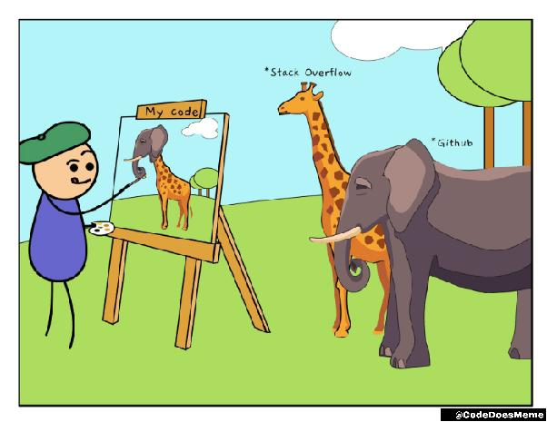
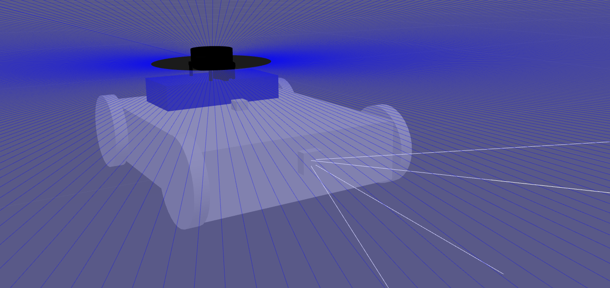
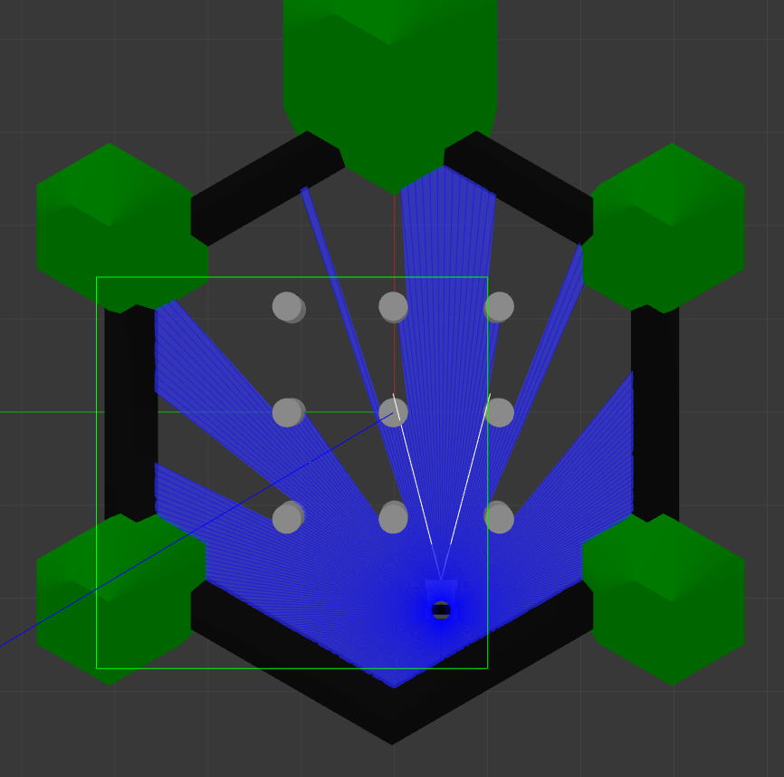
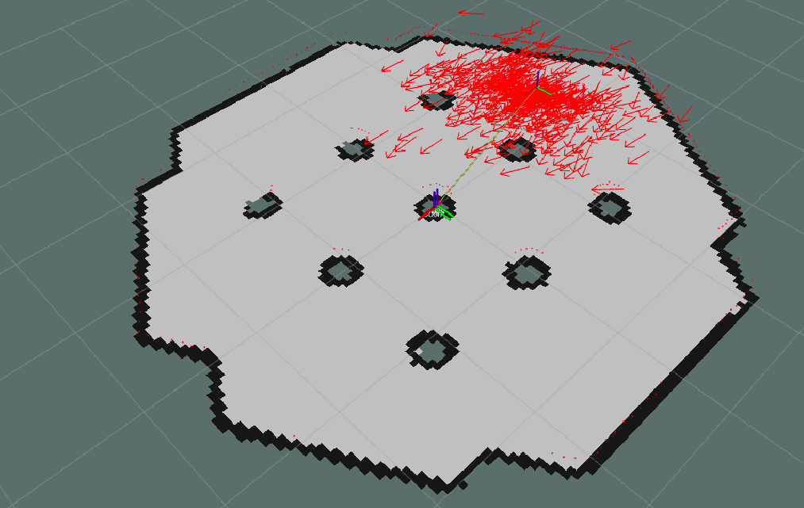
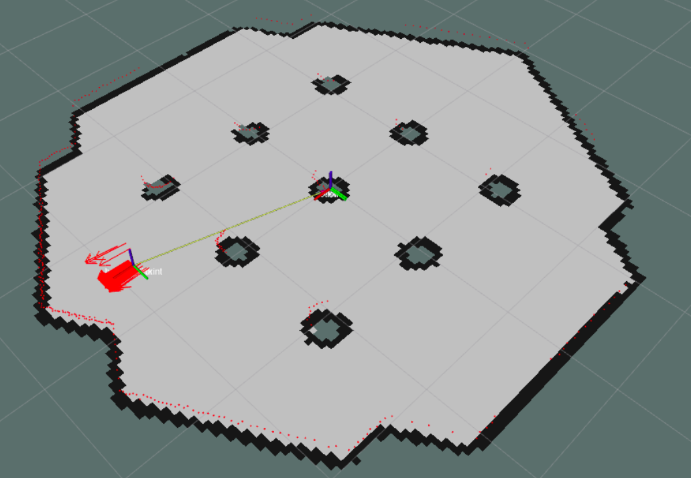

# Robot Simulation in Gazebo with ROS Noetic
This project is my way of diving back into robotics and computer vision, areas I’ve always been passionate about. As a software engineer, I’m working on this side project to learn new things and challenge myself. My ultimate goal is to create an autonomous robot in Gazebo simulation, and eventually bring it to life, letting it navigate and interact within my apartment.

In this repository, I’m sharing my progress in building and improving a skid-steer mobile robot simulation using Gazebo and ROS Noetic. The robot has a LiDAR sensor, an IMU, and an RGB camera. The project is inspired by a series of workshops, which you can find  [here](https://github.com/arab-meet), along with a lot of research—and, of course, some help from GitHub, StackOverflow, and whatever else I can dig up. As a ROS newbie, I’m piecing everything together from different sources, so expect a bit of a patchwork approach. It's all part of the journey!

*[Image Source](https://coderscat.com/learn-from-source-code/)*

---

## Features and Progress

### 1. **Robot Creation and Simulation**
The first milestone was creating the robot model using URDF and Xacro files. The robot was successfully spawned in a Gazebo simulation world, with its sensors fully integrated:
- **LiDAR sensor** for environmental scanning and obstacle detection.
- **IMU sensor** for orientation and angular velocity measurements.
- **RGB camera** for visual perception in the simulation.

Here is a screenshot of the robot in the simulation:

### 2. **Odometry Data Gathering**
To achieve accurate positioning, I worked on fusing odometry data from the motor encoders and the IMU sensor. An **Extended Kalman Filter (EKF)** was implemented to minimize errors and provide precise position estimates. This fusion ensured smooth and reliable localization in the `odom` frame.
-> IMU data is now faulty so only ground truth odometry data from gazebo is used

**Key frames involved:**
- `odom`: Represents the robot's odometry data.
- `base_link`: Central frame attached to the robot's body.
- `base_footprint`: Represents the ground contact of the robot.

### 3. **Localization Using AMCL**
Building on the odometry, I utilized **AMCL (Adaptive Monte Carlo Localization)** for localization within a static map. By combining:
- **Occupancy grid map**,
- **Odometry data**, and
- **LiDAR sensor data**, 
the robot's position in the `map` frame was estimated.

AMCL is a particle filter-based approach to localization with already known map. Initially, AMCL assumes an equal probability for the robot's location across the entire map. As the robot moves, it uses odometry data to predict its motion, and the LiDAR sensor refines this by matching observed data with the map. This process reduces uncertainty and allows the robot to localize itself accurately. Let me know if you’d like me to integrate this into the document!

Here is a screenshot of the AMCL localization process between the initial moment and after a moment:

---

## Next Phases

The next steps for this project include:
1. Implementing **SLAM (Simultaneous Localization and Mapping)** to dynamically generate maps while navigating.
2. Enhancing localization accuracy by refining the EKF and AMCL configurations.
3. Exploring advanced mapping techniques to improve the robot's perception of its environment.

---

## Frame Transformations

The following frame hierarchy is used throughout the project:
- `map`: Represents the global static map.
- `odom`: Tracks the robot's movement over time.
- `base_link`: Central reference frame of the robot.
- `base_footprint`: Contact point of the robot with the ground.

---

## Keywords
Localization, Mapping, Odometry, SLAM, ROS Noetic, Gazebo Simulation, AMCL, EKF

---